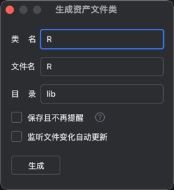

# Asset Generation Class

Right-click to select the assets menu or other folders

<<<<<<< HEAD

Select asset generation

Fill out the form

More features can be adjusted in settings

=======

Select asset generation

Fill out the form

More features can be adjusted in settings

>>>>>>> 9bd2974a6a06cdcd4b0cf104e44238350abd1f8a
