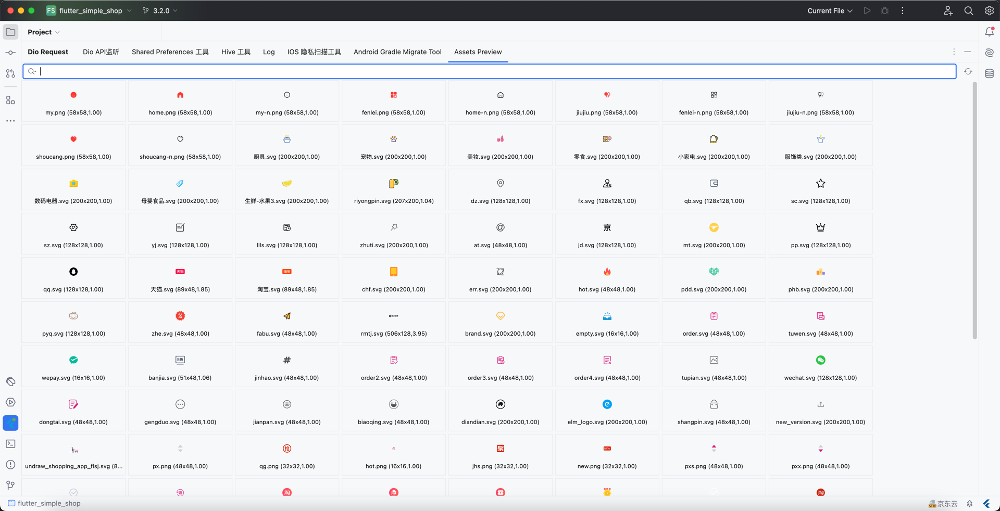
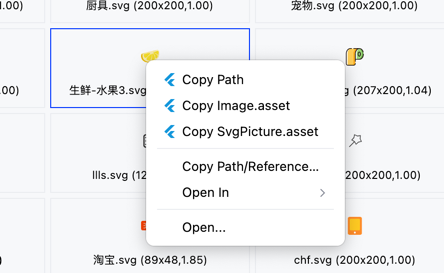
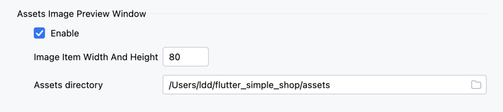

# Asset Preview Window

This allows you to conveniently browse all image files, SVG icons, etc. in your project.

> Right-click to bring up the menu, supports quick copying as Dart components

## 1. Window Preview

Supports filtering search by filename

<<<<<<< HEAD

## 2. Right-click Menu, Copy Component

=======

## 2. Right-click Menu, Copy Component

>>>>>>> 9bd2974a6a06cdcd4b0cf104e44238350abd1f8a

## 3. Settings

* You can configure the item size here and whether to enable this feature
* You can configure your custom assets file directory, the default is the assets folder

<<<<<<< HEAD

=======

>>>>>>> 9bd2974a6a06cdcd4b0cf104e44238350abd1f8a
