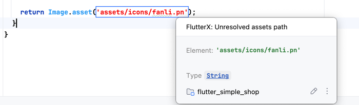

# Asset File Path Checking Feature

The editor will check asset paths

If the path is incorrect, it will turn red

<<<<<<< HEAD

=======

>>>>>>> 9bd2974a6a06cdcd4b0cf104e44238350abd1f8a

In the image above, the path is incorrect, so it's highlighted in red. After correcting it, it returns to normal.