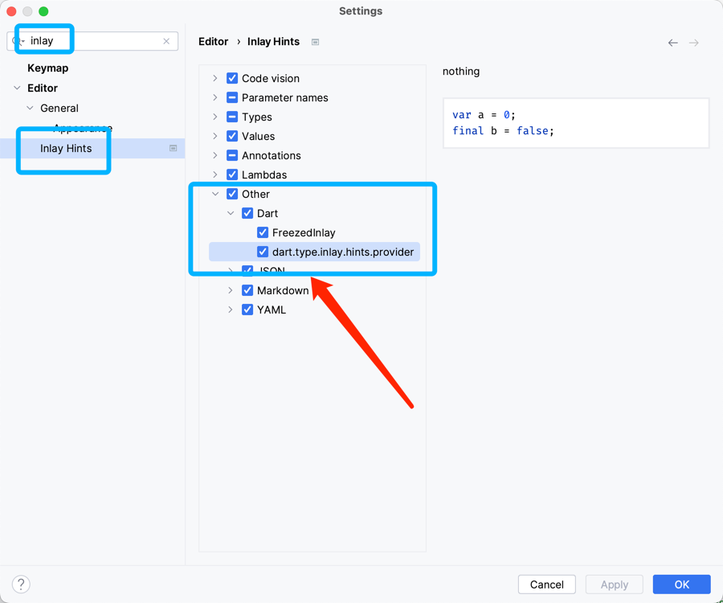
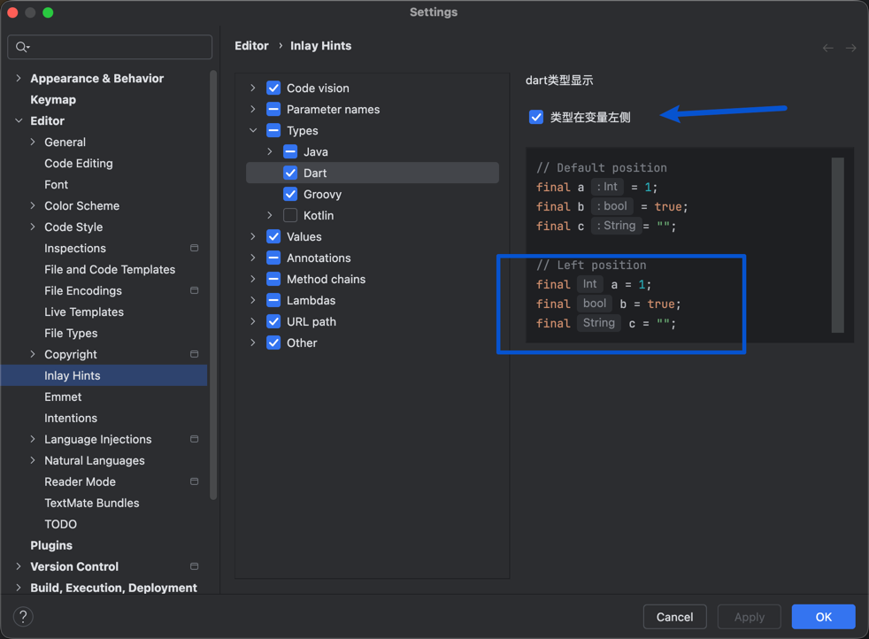

# Parameter Type Inline Display

## Inline Hints

This is essentially a virtual inline floating text that can provide type completion for variables declared with `final`, `var`, `const`, etc. It doesn't take up code space.

## Function Inline Hints

If you're using a newer version (3.8.x), similar to the example below, it will also provide type completion.

> If you have other places where you'd like to add this feature, please go to GitHub and create an issue

## Disable This Hint

As shown in the image below

## Display location
> v6.0.2 新增

Types are supported to be displayed to the left of the variable name

