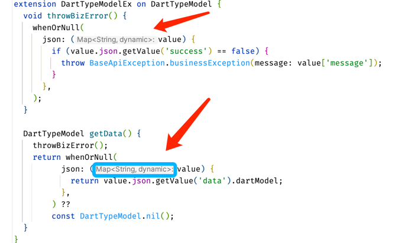

# Parameter Type Inline Display

## Inline Hints

This is essentially a virtual inline floating text that can provide type completion for variables declared with `final`, `var`, `const`, etc. It doesn't take up code space.

<<<<<<< HEAD

=======

>>>>>>> 9bd2974a6a06cdcd4b0cf104e44238350abd1f8a

## Function Inline Hints

If you're using a newer version (3.8.x), similar to the example below, it will also provide type completion.

<<<<<<< HEAD

=======

>>>>>>> 9bd2974a6a06cdcd4b0cf104e44238350abd1f8a

> If you have other places where you'd like to add this feature, please go to GitHub and create an issue

## Disable This Hint

As shown in the image below

<<<<<<< HEAD

=======

>>>>>>> 9bd2974a6a06cdcd4b0cf104e44238350abd1f8a
