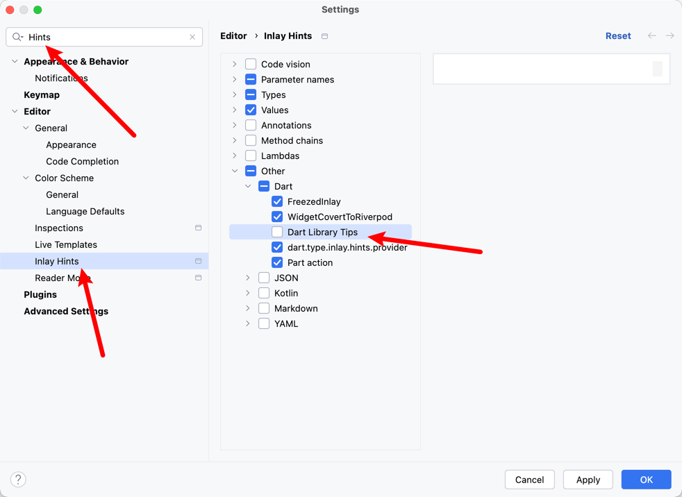

# Project Library scan

dart library auto suggestions completion

## Preview

> **Note**
> [Go to download](https://plugins.jetbrains.com/plugin/18986-flutterx/edit/versions/stable/576724)

enter the `part` trigger recommendations

<video controls autoplay loop muted playsinline style="max-width: 100%; height: auto;" aria-label="Project Library Scan preview" src="../../../assets/videos/gif/DartLibraryScanGif.mp4"></video>

## How to close

