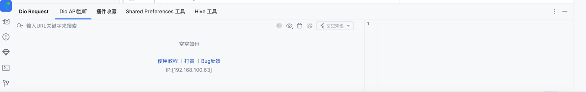
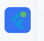
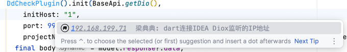
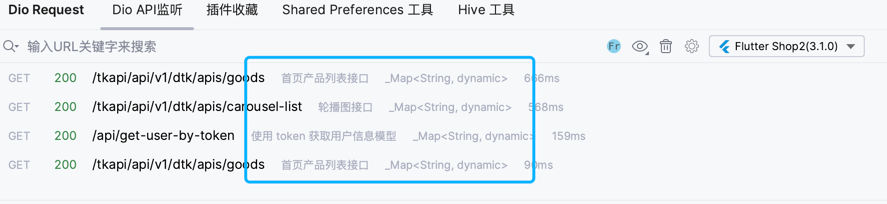
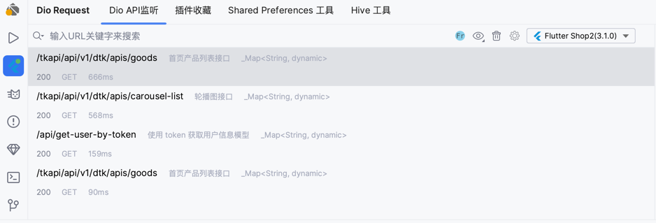
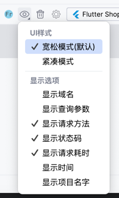
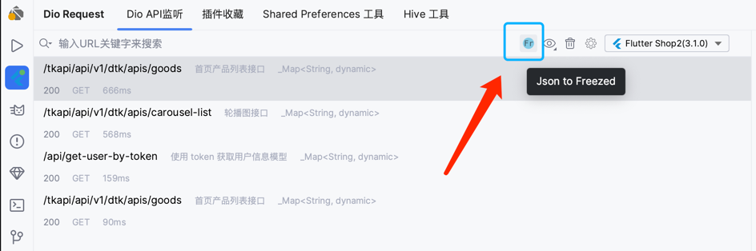
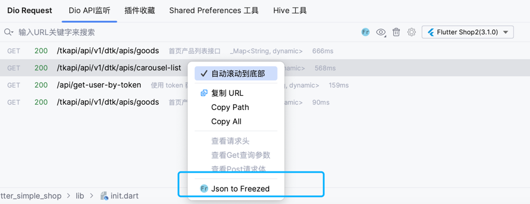
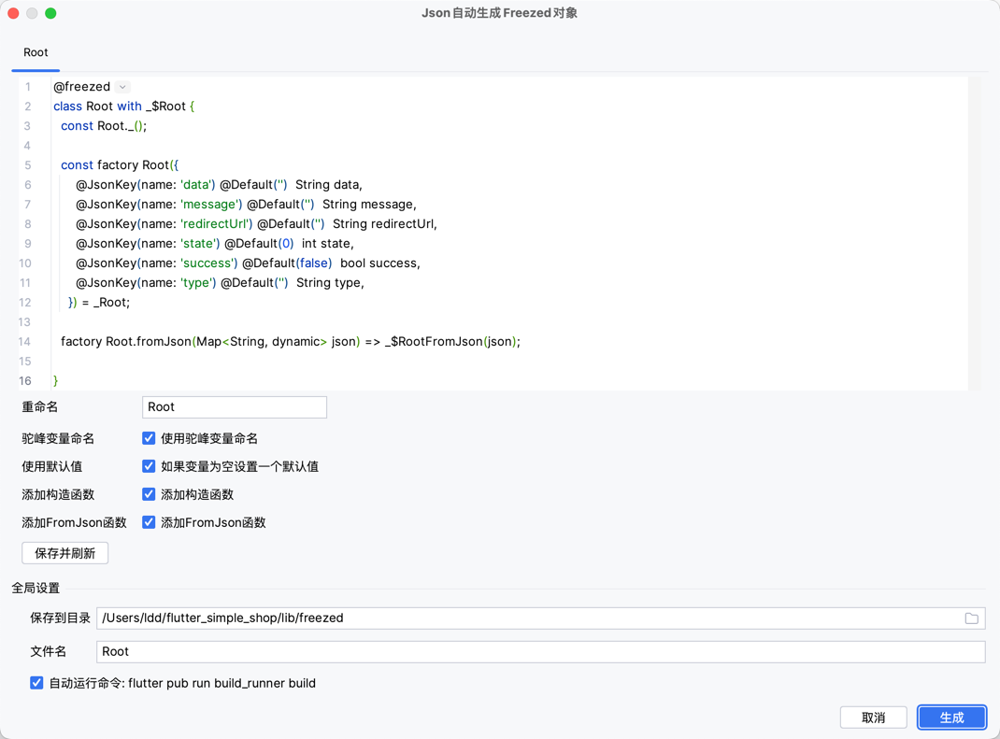

# Dio Request Monitoring

## 1. Window Preview

If you can't find this window, it may not be displayed by default. You need to manually open it from the menu bar: `View -> Tool Windows -> Dio Request`



## 2. Service Running Status

If you see a small green dot, it indicates the service is running and ready for connection.



## 3. Getting Started

[](https://pub.dev/packages/dd_check_plugin)

#### Add Dependency

```yaml
 dd_check_plugin: ^lastVersion
```

#### Install Dependencies

```bash
flutter pub get
```

#### Write Code

Pass your Dio singleton class to the plugin. The plugin will add an interceptor to monitor requests and send request models to the FlutterX plugin.

```dart
    void main(){
    DdCheckPlugin().init(Dio(),
        initHost: "192.168.100.63",
        port: 9999,
        projectName: 'App Name');
}
```

> **Explanation**
>
> Here's a simple explanation of how this feature works: The FlutterX plugin runs a Socket server, then connects through the initHost in the DdCheckPlugin#init function for data transmission. [Source code:](https://github.com/mdddj/dd_flutter_idea_plugin/blob/d5a57dcf769fd59c383fd89d21e6f6503bff948c/src/main/kotlin/shop/itbug/fluttercheckversionx/socket/service/DioApiService.kt#L112)

Below are the parameter descriptions for the `DdCheckPlugin#init` function:

| Parameter | Description |
|---|---|
| initHost | Your local IP address. Don't set it to 127.0.0.1, otherwise it won't connect in real device mode. Type `1` and the plugin will provide auto-completion for selection |
| port | Listening port, default is 9999. Can be changed in settings. No need to change unless special requirements. Remember to restart AS after modifying this setting |
| projectName | Customize your project name |
| customCoverterResponseData | Here you can modify the data model sent to IDEA. Usually no need to change, but you can add extra note information |
| timeOut | Timeout for connecting to the IDEA plugin |
| hostHandle | If initHost is not provided, the function will scan your IP range and try to auto-connect. Usually not needed |
| version | Data transmission format version, usually no need to change |
| conectSuccess | Callback for successful plugin connection, returns a connected socket object. Usually not needed |
| extend | Other tool extensions, such as Hive tool extension: `HiveToolManager`. You can also implement the `ServerMessageHandle` interface to handle data sent from the IDEA plugin |

## 4. Auto-complete initHost

The plugin will automatically recognize your IP address and provide suggestions.



## 5. Adding Notes to APIs

> **Note**
>
> Requires FlutterX version 3.8.0+

Use the `customCoverterResponseData` property to customize the response model sent to the IDE.
See the example below:

```dart
    DdCheckPlugin().init(
        BaseApi.getDio(),
        customCoverterResponseData: _customCoverterResponseData
);

SendResponseModel _customCoverterResponseData(SendResponseModel sendResponseModel) {
  final notes = <String>[];
  if (sendResponseModel.url.contains("/tkapi/api/v1/dtk/apis/goods")) {
    notes.add("Home product list API");
  } else if (sendResponseModel.url.contains("/tkapi/api/v1/dtk/apis/carousel-list")) {
    notes.add("Carousel API");
  } else if (sendResponseModel.url.contains("/api/get-user-by-token")) {
    notes.add("Get user info by token API");
  }
  notes.add("${sendResponseModel.response?.data.runtimeType}"); //Add response return type
  return sendResponseModel.copyWith(extendNotes: notes);
}
```

As shown in the image, string arrays in `SendResponseModel#extendNotes` will be displayed as tags in a loop under the URL.



If there are too many notes, it's recommended to use relaxed mode for display.



Here's my configuration:



## 6. Json to Freezed Model

> If you don't know what freezed is, it's highly recommended to learn about it. [Link](https://pub.dev/packages/freezed)

After selecting an API, click this icon to open the JSON to Freezed model configuration dialog.
Or right-click on the API to find this option in the context menu.





