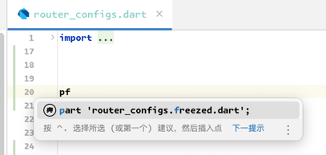

# Auto-generate .g, .freezed statements

FlutterX has built-in auto-completion statements

## pf

Type `pf` to automatically generate `filename.freezed.dart`

## pg

Type `pg` to automatically generate `filename.g.dart`

## ff

Type `ff` to automatically generate `freezed's fromJson method`

