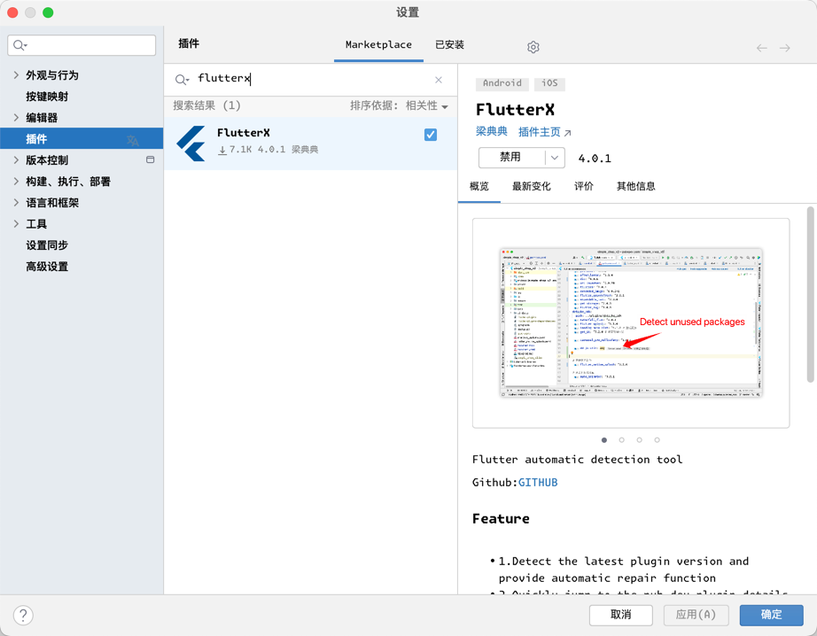

# Getting Started

[FlutterX](https://flutterx.itbug.shop) is an auxiliary tool plugin for Flutter developers' rapid development, supporting Dio request monitoring, JSON to Freezed object generation, Hive visualization, shared_preferences visual browsing, and many other powerful features.

> **Note**
>
> It is open source and free, developed and maintained by **Liang Diandian**. If you want to view the source code, please check [Github](https://github.com/mdddj/dd_flutter_idea_plugin)

## Install from IntelliJ IDEA Marketplace

1. Open the IntelliJ IDEA plugin marketplace and search for `flutterx`, the first one is it
2. 

## Compile from Source Code

> **Note**
>
> The plugin is written in Kotlin language and built with Gradle

1. Clone the source code

```bash
git clone https://github.com/mdddj/dd_flutter_idea_plugin
```

2. Install dependencies

```bash
cd dd_flutter_idea_plugin && ./gradlew -i --info
```

3. Build

```bash
./gradlew buildPlugin --info
```

## Compile for Other IntelliJ IDEA/Android Studio Versions

Check the version number corresponding to the version you want to compile, modify the corresponding `sinceBuildVersion` and `untilBuildVersion`, and rebuild.

> **Warning**
>
> After modification, JBR adaptation may be required

```kotlin
kotlin.stdlib.default.dependency=true
kotlin.incremental.useClasspathSnapshot=false
kotlin.experimental.tryK2=true
kapt.use.k2=true
pluginVersion=4.0.1
#===============================> 223 AS release version : https://plugins.jetbrains.com/docs/intellij/android-studio-releases-list.html
#===============================> Latest official version Giraffe
#dartVersion=223.8977
#flutterVersion=76.3.2
#sinceBuildVersion=223
#untilBuildVersion=223.*
#ideaVersion=2022.3.1.18
#ideaType=AI
#===============================> 231 AS Hedgehog version : https://plugins.jetbrains.com/docs/intellij/android-studio-releases-list.html
#dartVersion=231.9402
#flutterVersion=76.3.3
#sinceBuildVersion=231
#untilBuildVersion=231.*
#ideaVersion=2023.1.1.24
#ideaType=AI
#===============================> 232 AS   Iguana
#dartVersion=232.10248
#flutterVersion=76.3.4
#sinceBuildVersion=232
#untilBuildVersion=232.*
#ideaVersion=2023.2.1.11
#ideaType=AI
#===============================> 233 idea IU  2023.3
dartVersion=233.11799.172
flutterVersion=77.0.1
sinceBuildVersion=233
untilBuildVersion=233.*
ideaVersion=2023.3
ideaType=IU
#===============================================
```
