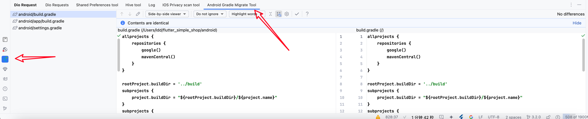
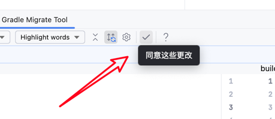

# Flutter 3.29.0 Android Gradle Migration Tool

Flutter 3.29.0 requires migration to a new Gradle version.

This tool can be found here:

<<<<<<< HEAD

Click the checkmark to apply these changes:

=======

Click the checkmark to apply these changes:

>>>>>>> 9bd2974a6a06cdcd4b0cf104e44238350abd1f8a
