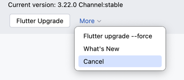

# Flutter Version Detection

By default, when opening a Flutter project, a process will start and make an HTTP request to access the Flutter version information API.

Request URL

> URL: [https://storage.googleapis.com/flutter_infra_release/releases/releases_macos.json](https://storage.googleapis.com/flutter_infra_release/releases/releases_macos.json)

> The API requires a proxy to access

## Screenshot Preview

"What's new" will redirect to the CHANGELOG.md file in the Flutter GitHub repository

## Feature Requirements - 2 Conditions Must Be Met

Version checking requires 2 conditions to be satisfied:

* Flutter command must be callable normally
* Must be able to access the above URL API normally

## Don't Need This Feature? Disable It Here

