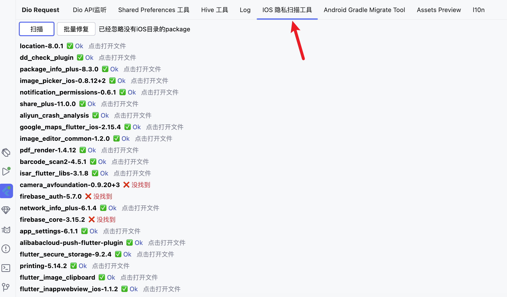

# iOS 17 Privacy Scanning Tool

Using the iOS privacy scanning tool, it will scan your project's third-party package dependencies, identify which plugins have added privacy files and which packages haven't, and mark them in the window.

> This feature is enabled in FlutterX version 3.1.5

> **Provides automatic repair functionality**
>
> Click the "Batch Fix" button in the window, and it will automatically add a privacy file in the `ios` directory for those packages that haven't added privacy files
>

## Getting Started

Find the FlutterX tool window and open the privacy scanning tool window

> If the list doesn't display, click the scan button - it may take some time to scan

<<<<<<< HEAD

=======

>>>>>>> 9bd2974a6a06cdcd4b0cf104e44238350abd1f8a

## Execute Batch Fix Function

Click the `Batch Fix` button and confirm in the popup dialog

## Open Privacy File for Confirmation

<<<<<<< HEAD
Click on list items to open the privacy manifest file in the editor. You can modify its values if needed
=======
Click on list items to open the privacy manifest file in the editor. You can modify its values if needed
>>>>>>> 9bd2974a6a06cdcd4b0cf104e44238350abd1f8a
