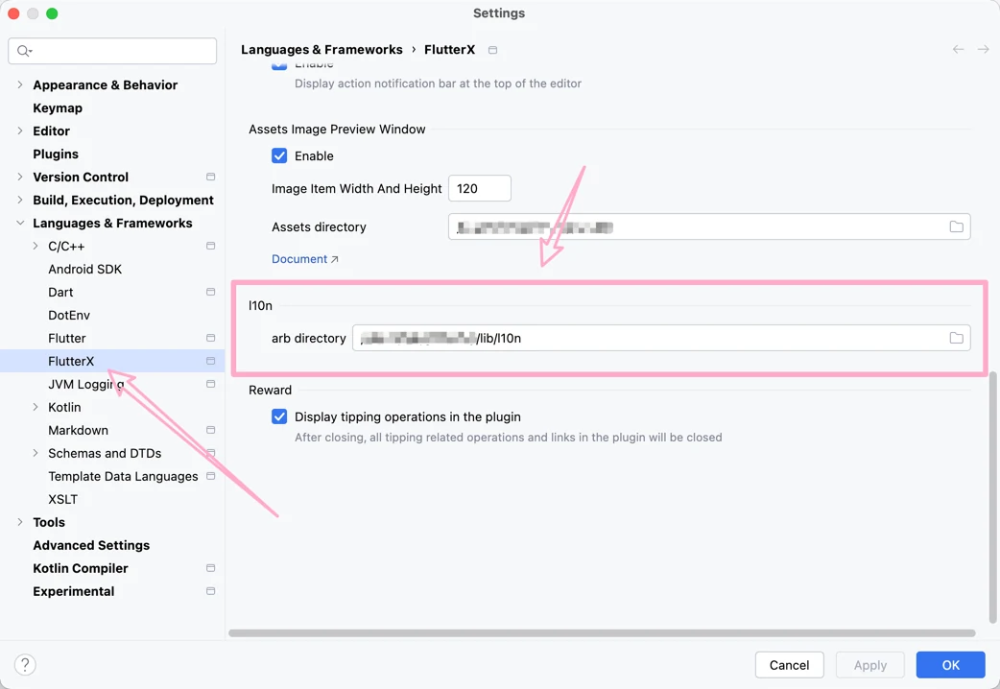
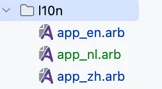
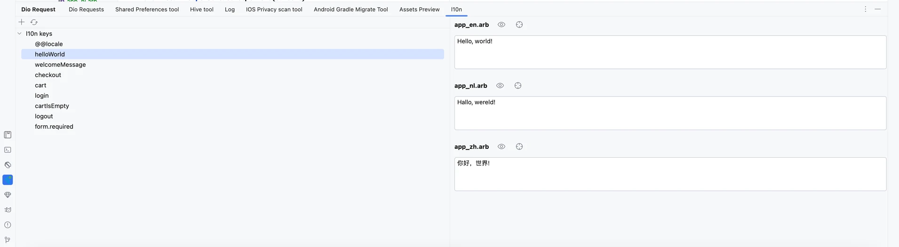
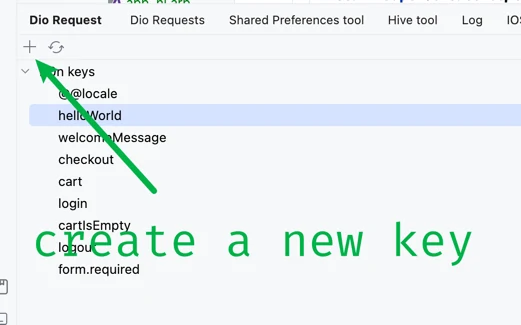
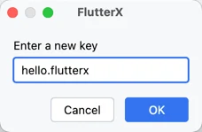
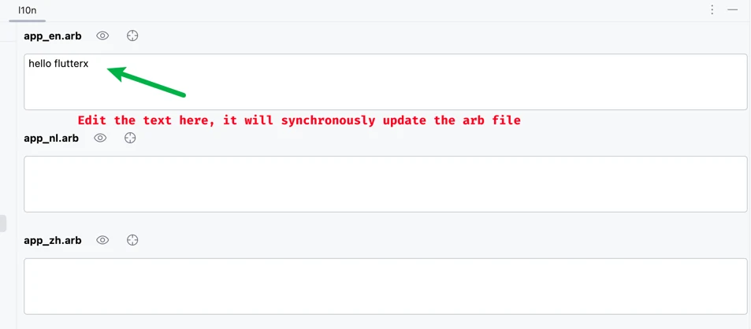
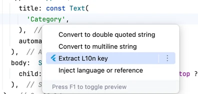
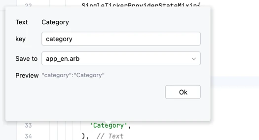

# l10n editor

## 1.Config l10n folder

open flutterx setting panel

## 2.Use l10n panel

Enter your new key

Click ok button,it will inset key to your all arb files

## Extract l10n key

Quickly extract strings as l10n keys

It will insert a new json node in app_en.arb

## More features are being added..

