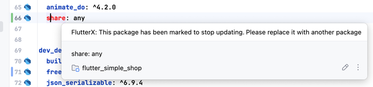

# Outdated Package Detection

If a package on pub.dev has been marked by the author as no longer updated

<<<<<<< HEAD

It will be highlighted in red, alerting you that the package author is no longer updating it, and you should use other packages as replacements

=======

It will be highlighted in red, alerting you that the package author is no longer updating it, and you should use other packages as replacements

>>>>>>> 9bd2974a6a06cdcd4b0cf104e44238350abd1f8a
