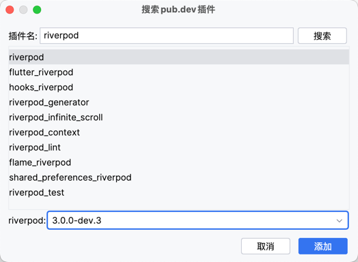
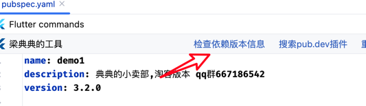

# Third-Party Package Tools

Here's an introduction to the related features of the `pubspec.yaml` file

## Search Packages

Search packages directly within the plugin

<<<<<<< HEAD

=======

>>>>>>> 9bd2974a6a06cdcd4b0cf104e44238350abd1f8a

## Plugin Version Detection

<note>

I recommend updating all packages to the latest version to avoid many hidden bugs

</note>

> If you don't need version detection, click the Dart icon on the left, then click "Don't detect new versions". It will automatically ignore this the next time you enter the file.

<<<<<<< HEAD

=======

>>>>>>> 9bd2974a6a06cdcd4b0cf104e44238350abd1f8a

## Plugin Information Panel

Hover your mouse over the plugin name to display the plugin details panel

<<<<<<< HEAD

=======

>>>>>>> 9bd2974a6a06cdcd4b0cf104e44238350abd1f8a

## Quick Jump to Package Homepage

Click the icon to jump to the pub.dev package homepage

<<<<<<< HEAD

## Detect Unused Packages

=======

## Detect Unused Packages

>>>>>>> 9bd2974a6a06cdcd4b0cf104e44238350abd1f8a

## Check Package Information

Here you can view the package update date. It's recommended to replace packages that haven't been updated for a long time.

<<<<<<< HEAD

=======

>>>>>>> 9bd2974a6a06cdcd4b0cf104e44238350abd1f8a
