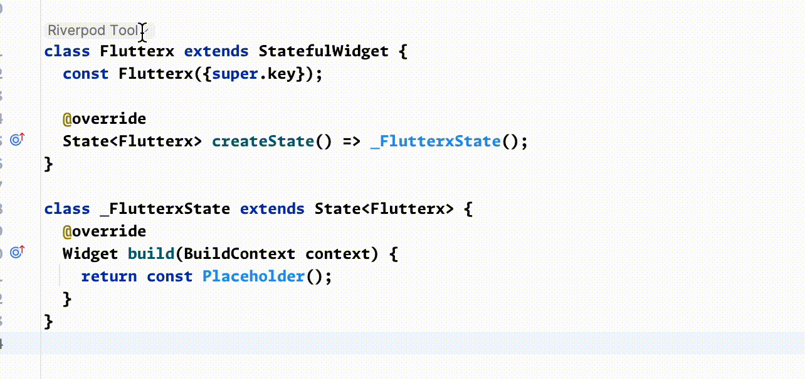

# Riverpod Widget Tool

This tool can automatically convert StatelessWidget to ConsumerWidget

It can also automatically convert StatefulWidget to ConsumerStatefulWidget

> Although the Riverpod author provides a plugin package `custom_lint` that can achieve similar functionality, this package will start a Dart analyzer in the background, consuming a lot of memory (about 2GB of memory). Users with large memory can ignore this feature.

<warning>
    
Note: You need to add the flutter_hooks package to use this feature

</warning>

#### Feature Preview (StatelessWidget)

<<<<<<< HEAD

#### Feature Preview (StatefulWidget)

=======

#### Feature Preview (StatefulWidget)

>>>>>>> 9bd2974a6a06cdcd4b0cf104e44238350abd1f8a
