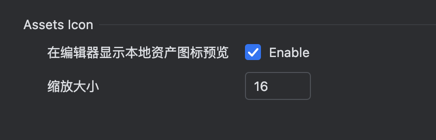
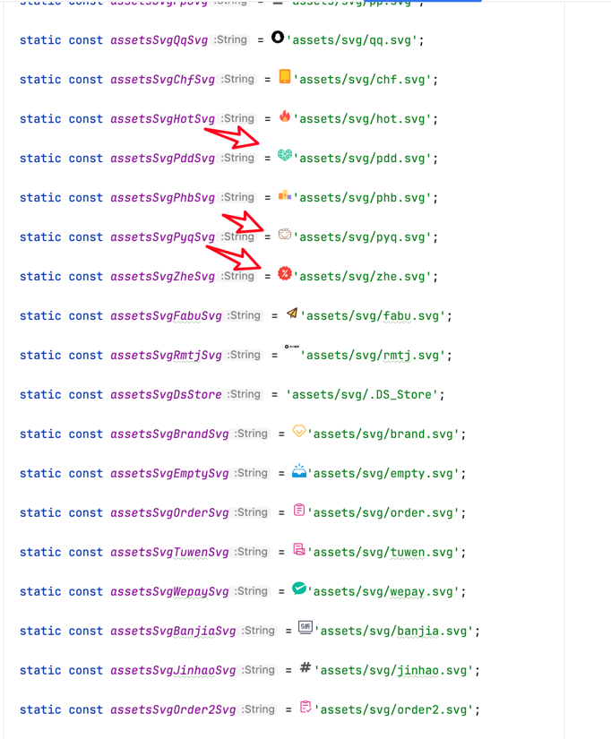

# Inline Asset Display

Whether to display image previews in the editor

When the feature is enabled, assets preview will be displayed in the editor

When disabled, it will not be displayed

Default maximum width is 16px, which can be freely configured

Hover your mouse over the string to display a large image preview and some basic information about the image

