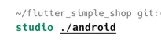
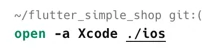
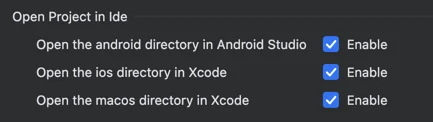
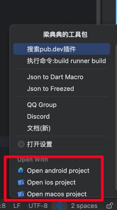

# Quick Open Subdirectory Folders

Commands to open corresponding directories:

> Android studio: `studio android path`

> xcode: `open -a Xcode ios/macos path`

If opening fails, please confirm whether these commands are valid

## Settings

These are feature toggles that can disable the display of these functions in the bottom shortcut menu

If disabled in settings, the shortcut operations within the red circle below will be hidden

