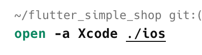

# Quick Open Subdirectory Folders

Commands to open corresponding directories:

> Android studio: `studio android path`

> xcode: `open -a Xcode ios/macos path`

If opening fails, please confirm whether these commands are valid

<<<<<<< HEAD

=======

>>>>>>> 9bd2974a6a06cdcd4b0cf104e44238350abd1f8a

## Settings

These are feature toggles that can disable the display of these functions in the bottom shortcut menu

<<<<<<< HEAD

If disabled in settings, the shortcut operations within the red circle below will be hidden

=======

If disabled in settings, the shortcut operations within the red circle below will be hidden

>>>>>>> 9bd2974a6a06cdcd4b0cf104e44238350abd1f8a
