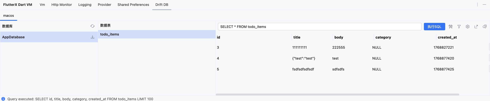
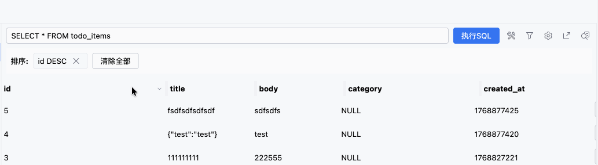
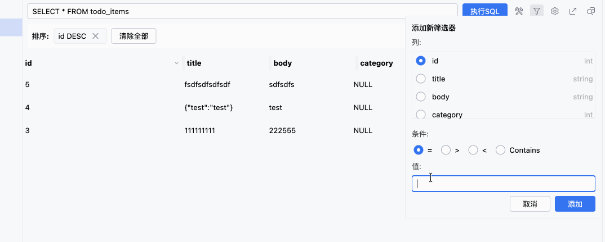
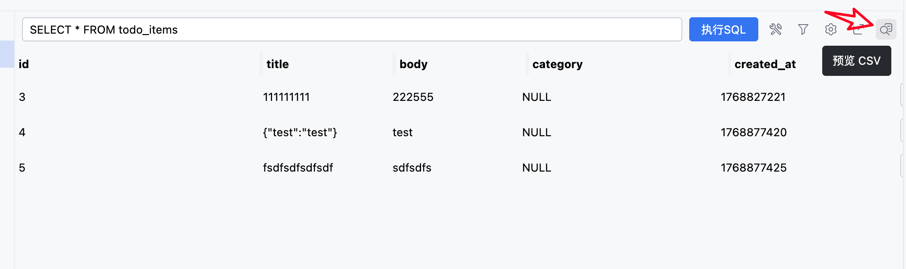
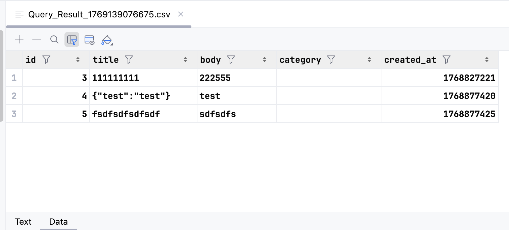
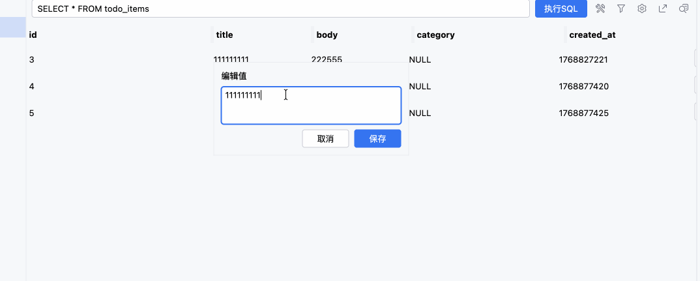
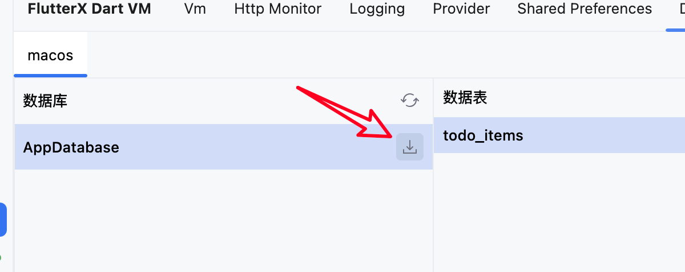
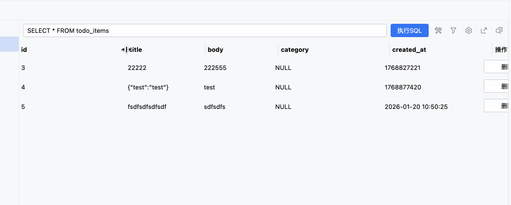
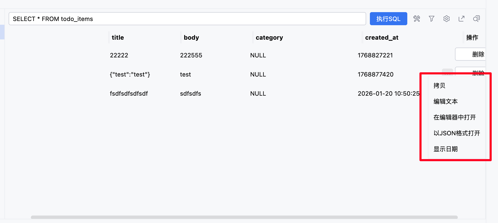

# Drift

> v 6.9.0 New

## Overview

Drift database viewer, supporting visual operations on the database.

## Features

- View database tables
- Sorting and filtering
- Export to CSV
- Preview data tables in editor
- Dynamically adjust column widths
- Edit column data
- Delete table data
- Execute database tables dynamically

## Usage

You need to add Drift-related dependencies to your project and execute code related to opening a database for it to appear in the plugin.

## Screenshot Preview

## Sorting

## Filtering

## Preview Data Tables in Editor

> This requires IDE plugin support; tested successfully in version 2025.2.3 without additional plugins.

## Edit Column Data

## Export CSV

## Export as SQLite

## Resizable Columns

## Others

There are also some common features like copying values, opening text in the editor, opening values as JSON, etc.

