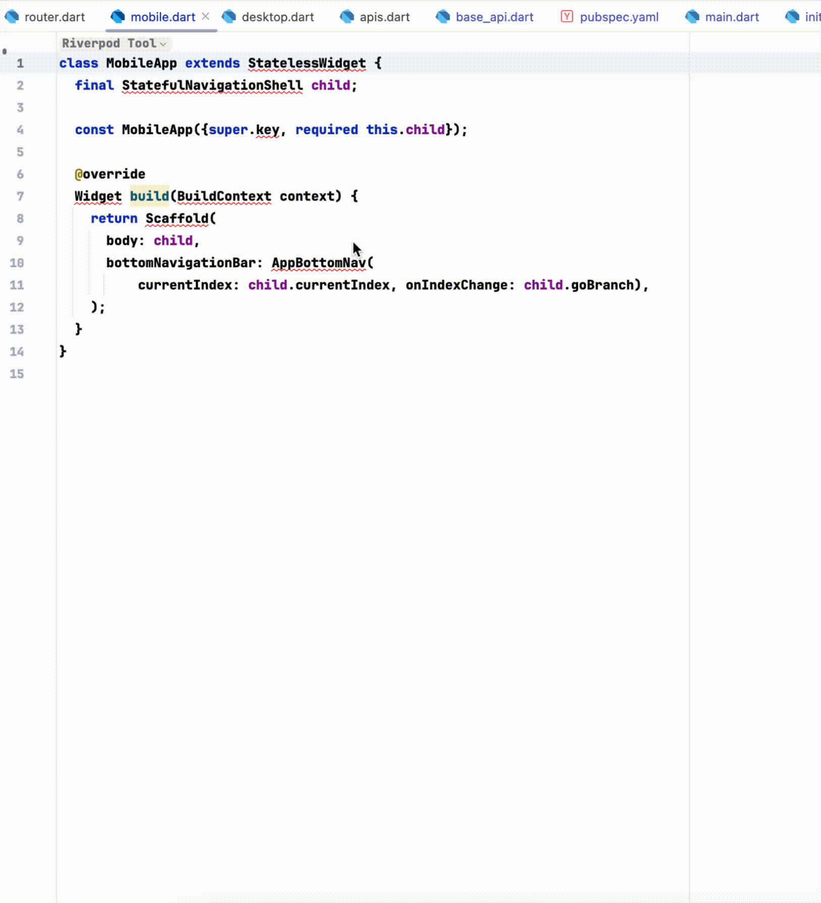

# プロジェクトライブラリスキャン

Dartライブラリの自動サジェスト補完

## プレビュー

> **注意**
> [ダウンロードはこちら](https://plugins.jetbrains.com/plugin/18986-flutterx/edit/versions/stable/576724)

`part`を入力してトリガーの推奨事項を表示

<<<<<<< HEAD

=======

>>>>>>> 9bd2974a6a06cdcd4b0cf104e44238350abd1f8a

## 閉じる方法

<<<<<<< HEAD

=======

>>>>>>> 9bd2974a6a06cdcd4b0cf104e44238350abd1f8a
