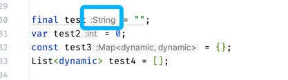
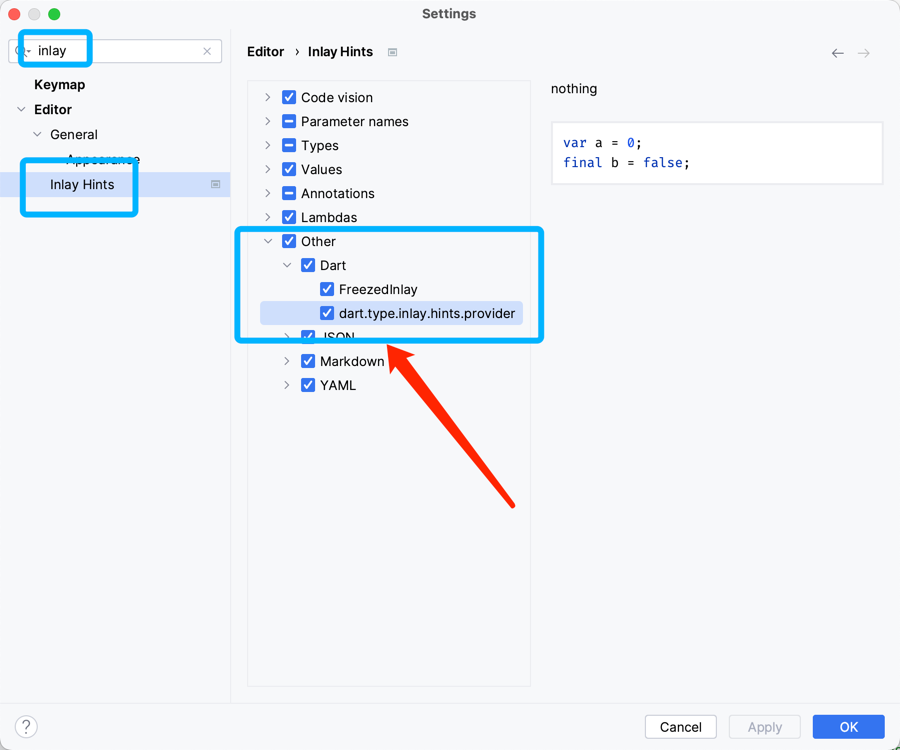

# パラメータ型インライン表示

## インラインヒント

実際には仮想的なインラインフローティングテキストで、`final`、`var`、`const`などで宣言された変数に型を補完できます。コードスペースを占有しません。

<<<<<<< HEAD

=======

>>>>>>> 9bd2974a6a06cdcd4b0cf104e44238350abd1f8a

## 関数インラインヒント

新しいバージョン(3.8.x)を使用している場合、以下のようなものも型を補完します。

<<<<<<< HEAD

=======

>>>>>>> 9bd2974a6a06cdcd4b0cf104e44238350abd1f8a

> 他の場所に追加したい場合は、GitHubにissueを追加してください。

## このヒントを閉じる

下図の通り

<<<<<<< HEAD

=======

>>>>>>> 9bd2974a6a06cdcd4b0cf104e44238350abd1f8a
