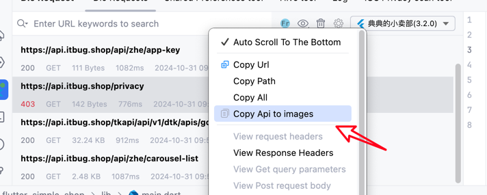

# リクエスト情報スクリーンショット

インターフェースメニューを右クリックして選択

APIインターフェース情報をコピーを選択すると、インターフェース情報がクリップボードにコピーされます。

> 注意: インターフェース情報が大きすぎる場合、失敗してエラーが発生します。これは一時的に解決しません。

<<<<<<< HEAD

=======

>>>>>>> 9bd2974a6a06cdcd4b0cf104e44238350abd1f8a

## スクリーンショット例

これがスクリーンショットされたものです。キーは設定で変更できます。

<<<<<<< HEAD

=======

>>>>>>> 9bd2974a6a06cdcd4b0cf104e44238350abd1f8a

## スクリーンショットキーの変更

<<<<<<< HEAD

=======

>>>>>>> 9bd2974a6a06cdcd4b0cf104e44238350abd1f8a
