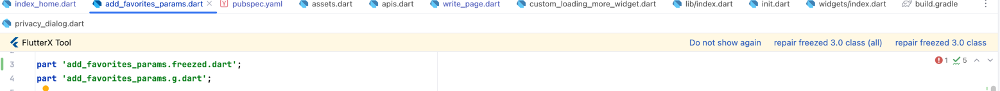
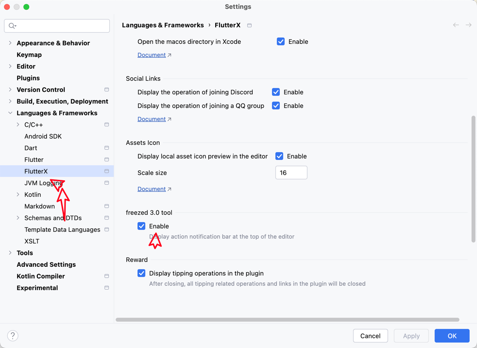

# freezed 3.xバージョン移行ツール

freezed 3.0バージョンには変更があり、classの前にsealedまたはabstractキーワードを追加する必要があります。

このfreezedを大量に使用しているため、2.0から3.0バージョンへの移行を容易にするためにこのツールを作成しました。そうでなければ、大量のクラスを修正する必要があります。

> **注意** エディタの上部に操作通知バーが表示されますが、バグや誤って表示された場合は閉じることができます。

<<<<<<< HEAD

=======

>>>>>>> 9bd2974a6a06cdcd4b0cf104e44238350abd1f8a

現在のファイルの修正と、プロジェクト全体のスキャン修正をサポートしています。

> **注意**

<<<<<<< HEAD

=======

>>>>>>> 9bd2974a6a06cdcd4b0cf104e44238350abd1f8a
