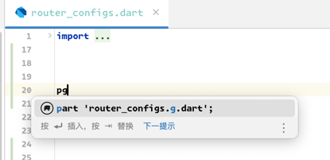
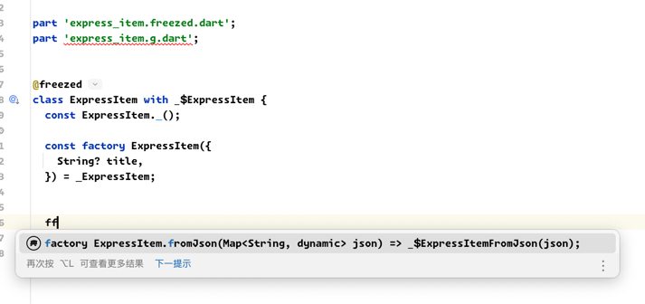

# .g.dart、.freezed.dartステートメントの自動生成

Flutterxにはいくつかの自動補完ステートメントが内蔵されています。

## pf

`pf`と入力すると、`ファイル名.freezed.dart`が自動生成されます。

<<<<<<< HEAD

=======

>>>>>>> 9bd2974a6a06cdcd4b0cf104e44238350abd1f8a

## pg

`pg`と入力すると、`ファイル名.g.dart`が自動生成されます。

<<<<<<< HEAD

=======

>>>>>>> 9bd2974a6a06cdcd4b0cf104e44238350abd1f8a

## ff

`ff`と入力すると、`freezedのfromJsonメソッド`が自動生成されます。

<<<<<<< HEAD

=======

>>>>>>> 9bd2974a6a06cdcd4b0cf104e44238350abd1f8a
