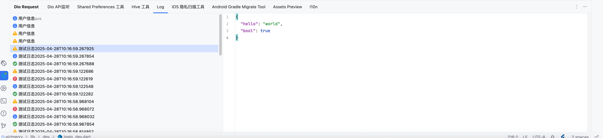

# ログ


## ログウィンドウ

> **注意**
>


コンソールでデータを見ると直感的でなく、不便なので、このログパネルを作成しました。


<<<<<<< HEAD

=======

>>>>>>> 9bd2974a6a06cdcd4b0cf104e44238350abd1f8a


## 使い方?


プロジェクトで [dd_check_plugin(v4.0.0+)](https://pub.dev/packages/dd_check_plugin) パッケージをインポートしてください。


FlutterXプラグインに接続してください。


```dart

            DdCheckPlugin().init(Dio(),
                    initHost: "192.168.199.1", // ローカルネットワークIPに切り替えてください
                    port: 9999, // socket ポート、デフォルト 9999
                    connectSuccess: (socket,SocketConnect connect) {
                // FlutterX 接続成功コールバック
            }, connectDisconnected: (connect) {
                //接続切断コールバック
            }, extend: [
                HiveToolManager(boxList: [DevCache.instance, AppMapCache(), UserCache()])
            ]);

```


IDEAプラグインへの接続に成功すると、`SocketConnect` オブジェクトが返されます。このオブジェクトはいくつかの関数をカプセル化しており、FlutterXに対して操作を行うことができます。


SocketConnect インスタンスを保存し、このログ送信関数を呼び出してください。


```dart

            connect.sendJsonLog(
                "テストログ", //タイトル
                {"hello":"world"}, // データ
                subTitle: "sub title", // サブタイトル
                type: FlutterXLogType.info // アイコン
            );

```


## 組み込みのカプセル化関数を使用してログを送信


dd_check_plugin は接続インスタンス管理クラスをカプセル化しており、直接使用できます。


```dart

            FlutterXConnectManager.instance.getFirstConnect()?.sendJsonLog("テストログ${DateTime.now().toIso8601String()}", {
                "hello":"world",
                "bool":true
              },type: FlutterXLogType.success);
