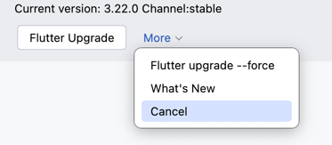
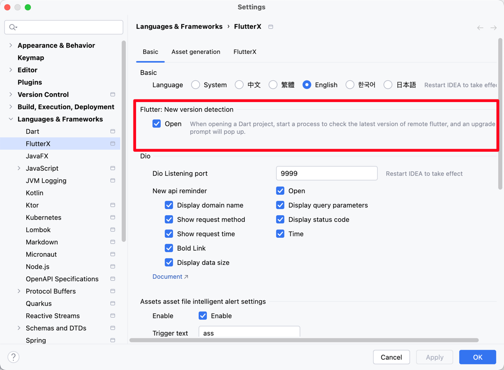

# Flutter新バージョン検出

Flutterプロジェクトを開く際にデフォルトでプロセスが起動し、HTTPリクエストが発行され、Flutterバージョン情報のインターフェースにアクセスします。

リクエストURL

> URL: [https://storage.googleapis.com/flutter_infra_release/releases/releases_macos.json](https://storage.googleapis.com/flutter_infra_release/releases/releases_macos.json)

> インターフェースにアクセスするにはプロキシを有効にする必要があります。

## スクリーンショットプレビュー

<<<<<<< HEAD

=======

>>>>>>> 9bd2974a6a06cdcd4b0cf104e44238350abd1f8a

whats new はFlutter GitHubリポジトリのCHANGELOG.mdファイルにジャンプします。

## 機能が必要とする2つの条件

新バージョンチェックには2つの条件が必要です。

* Flutterコマンドが正常に呼び出せること
* 上記URLインターフェースに正常にアクセスできること

## この機能が不要な場合、ここで無効化してください。

<<<<<<< HEAD

=======

>>>>>>> 9bd2974a6a06cdcd4b0cf104e44238350abd1f8a
