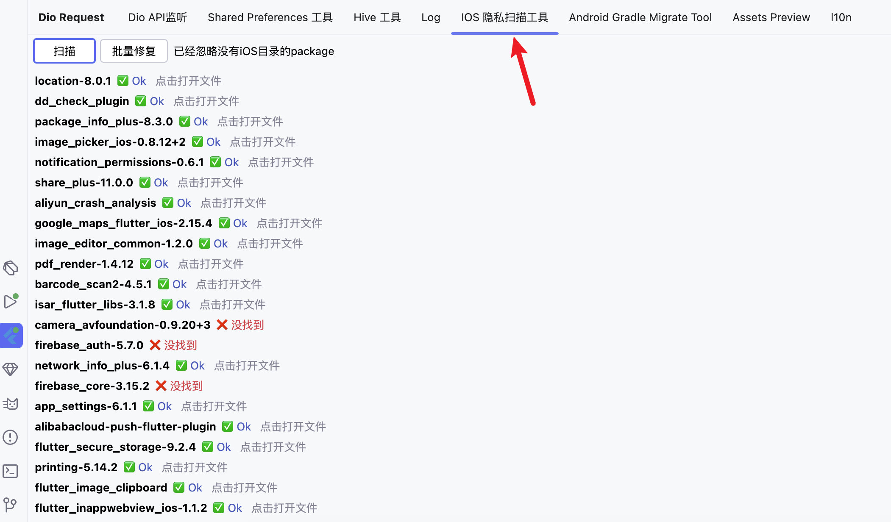

# iOS 17 プライバシースキャンツール

iOSプライバシースキャンツールを使用すると、プロジェクトの依存サードパーティパッケージをスキャンし、どのプラグインがプライバシーファイルを追加しているか、どのパッケージがプライバシーファイルを追加していないかを検索し、ウィンドウでマークします。

> この機能はFlutterX3.1.5バージョンで有効化されます。

> **自動修復機能を提供**
>
> ウィンドウの「一括修復」ボタンをクリックすると、プライバシーファイルを追加していないパッケージに対して、`ios`ディレクトリに自動的にプライバシーファイルを追加します。
>

## 使い方

FlutterXツールウィンドウを見つけ、プライバシースキャンツールウィンドウを開いてください。

> リストが表示されない場合は、スキャンボタンをクリックしてください。スキャンには少し時間がかかる場合があります。

## 一括修復機能の実行

`一括修復`ボタンをクリックし、ポップアップで確認してください。

## プライバシーファイルの確認

リスト項目をクリックすると、エディタでプライバシー清単ファイルを開くことができ、必要に応じて値を自分で変更できます。
