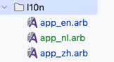
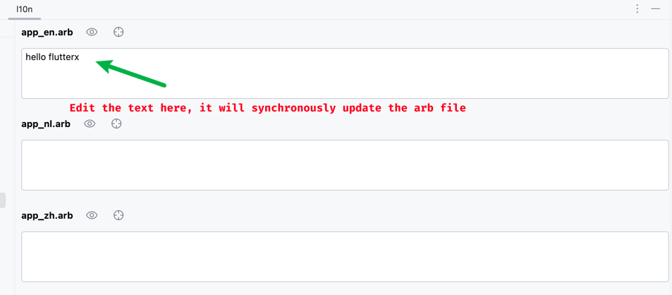

# l10n エディター

## 1.l10nフォルダの設定

Flutterx設定パネルを開く

<<<<<<< HEAD

=======

>>>>>>> 9bd2974a6a06cdcd4b0cf104e44238350abd1f8a

> **注意**
>

## 2.l10nパネルの使用

<<<<<<< HEAD

新しいキーを入力

OKボタンをクリックすると、すべてのarbファイルにキーが挿入されます。

=======

新しいキーを入力

OKボタンをクリックすると、すべてのarbファイルにキーが挿入されます。

>>>>>>> 9bd2974a6a06cdcd4b0cf104e44238350abd1f8a

## l10nキーの抽出

文字列をl10nキーとして素早く抽出

<<<<<<< HEAD

=======

>>>>>>> 9bd2974a6a06cdcd4b0cf104e44238350abd1f8a

app_en.arbに新しいJSONノードが挿入されます。

<<<<<<< HEAD

=======

>>>>>>> 9bd2974a6a06cdcd4b0cf104e44238350abd1f8a

## さらなる機能が追加中..
