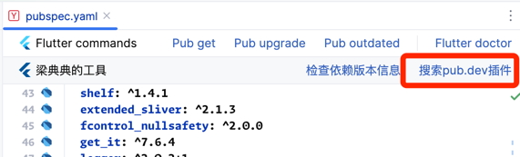

# サードパーティパッケージツール

ここでは`pubspec.yaml`ファイルの関連機能について紹介します。

## パッケージ検索

プラグイン内で直接パッケージを検索

<<<<<<< HEAD

=======

>>>>>>> 9bd2974a6a06cdcd4b0cf104e44238350abd1f8a

## プラグイン新バージョン検出

<note>

典典はすべてのパッケージを最新バージョンに更新することを推奨します。これにより多くの隠れたバグを回避できます。

</note>

> 新バージョンの検出が必要ない場合は、左側のDartアイコンをクリックし、「新バージョンを検出しない」をクリックしてください。次回ファイルを開いたときに自動的に無視されます。

<<<<<<< HEAD

=======

>>>>>>> 9bd2974a6a06cdcd4b0cf104e44238350abd1f8a

## プラグイン情報パネル

マウスをプラグイン名の上に移動すると、プラグイン詳細パネルが表示されます。

<<<<<<< HEAD

=======

>>>>>>> 9bd2974a6a06cdcd4b0cf104e44238350abd1f8a

## パッケージホームページへのクイックジャンプ

アイコンをクリックするとpub.devパッケージホームページにジャンプします。

<<<<<<< HEAD

## 使用されていないパッケージの検出

=======

## 使用されていないパッケージの検出

>>>>>>> 9bd2974a6a06cdcd4b0cf104e44238350abd1f8a

## パッケージ情報のチェック

ここでパッケージの更新日付を確認できます。長期間更新されていないパッケージは置き換えることを推奨します。

<<<<<<< HEAD

=======

>>>>>>> 9bd2974a6a06cdcd4b0cf104e44238350abd1f8a
