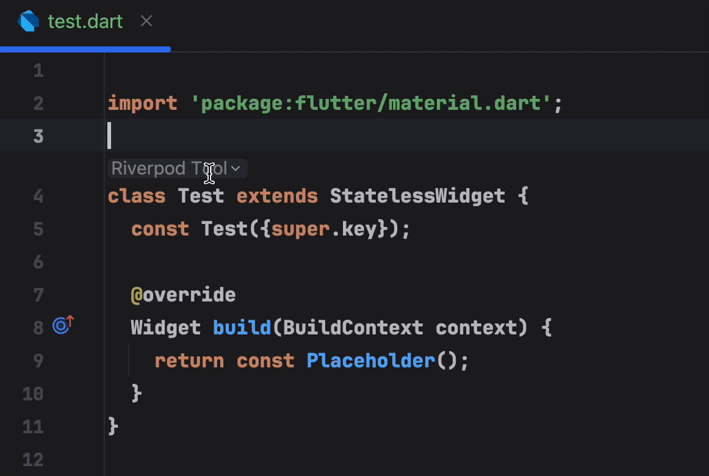

# Riverpod

エディタにRiverpodクイックスイッチツールを表示するかどうか

<<<<<<< HEAD

=======

>>>>>>> 9bd2974a6a06cdcd4b0cf104e44238350abd1f8a

オフにするとこれが表示されません。

<<<<<<< HEAD

=======

>>>>>>> 9bd2974a6a06cdcd4b0cf104e44238350abd1f8a

ここでもオンまたはオフにできます。

<<<<<<< HEAD

=======

>>>>>>> 9bd2974a6a06cdcd4b0cf104e44238350abd1f8a

## 自動インポート

<<<<<<< HEAD

> 設定でカスタムインポート内容を設定できます。他のパッケージでも可能です。

=======

> 設定でカスタムインポート内容を設定できます。他のパッケージでも可能です。

>>>>>>> 9bd2974a6a06cdcd4b0cf104e44238350abd1f8a
