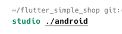
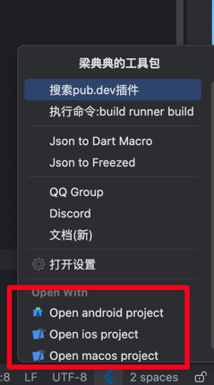

# サブディレクトリフォルダのクイックオープン

対応するコマンドを開く:

> Android studio: `studio android path`

> xcode: `open -a Xcode ios/macos path`

オープンに失敗する場合は、これらのコマンドが有効かどうか確認してください。

<<<<<<< HEAD

=======

>>>>>>> 9bd2974a6a06cdcd4b0cf104e44238350abd1f8a

## 設定

これらは機能スイッチで、ボトムクイックメニューでの表示をオフにできます。

<<<<<<< HEAD

=======

>>>>>>> 9bd2974a6a06cdcd4b0cf104e44238350abd1f8a

設定でオフにすると、下図の赤丸内のクイック操作が非表示になります。

<<<<<<< HEAD

=======

>>>>>>> 9bd2974a6a06cdcd4b0cf104e44238350abd1f8a
