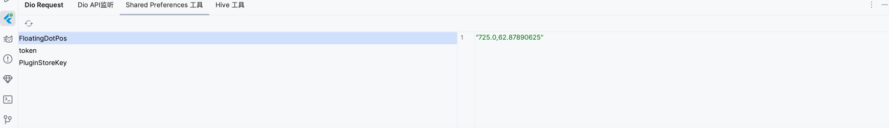
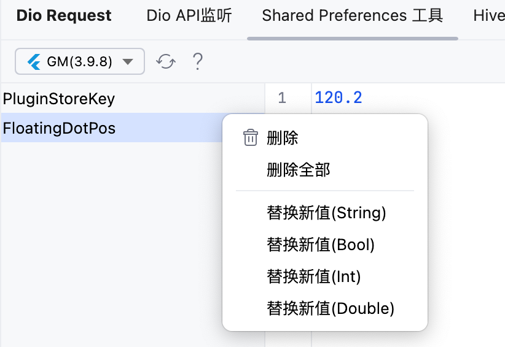

# shared_preferencesツール

このツールウィンドウは、`shared_preferences`プラグインのキャッシュを表示するために使用できます。

> この機能を使用する前提は、Dioの場合と同様に、dd_check_pluginを使用してまずIDEAに接続する必要があります。

## プレビュー

左側はすべてのキーのリストです。

右側にはキーに対応する値が表示されます。

## 右クリックメニュー

> `dd_check_plugin`のバージョンが4.0.2以上、`flutterX`のバージョンが5.7.0以上である必要があります。

ここでSPキャッシュを操作できます。

