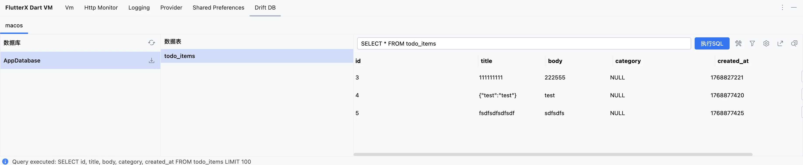
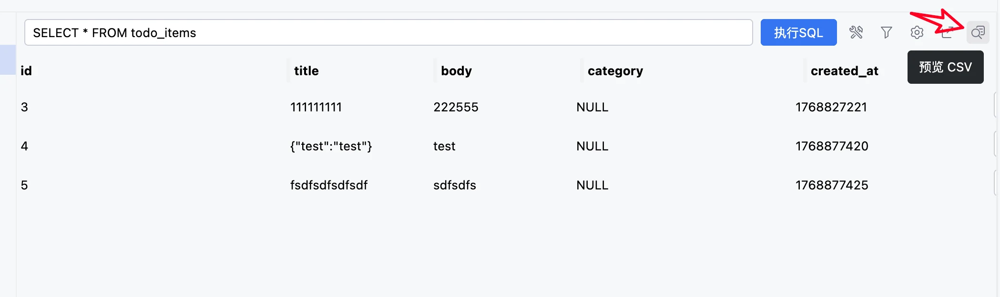
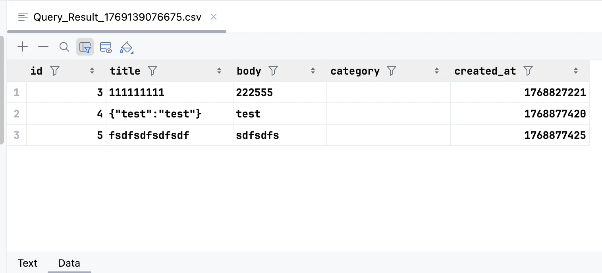
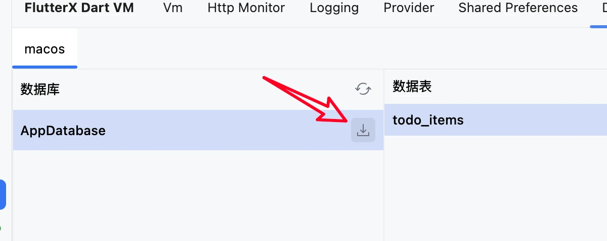
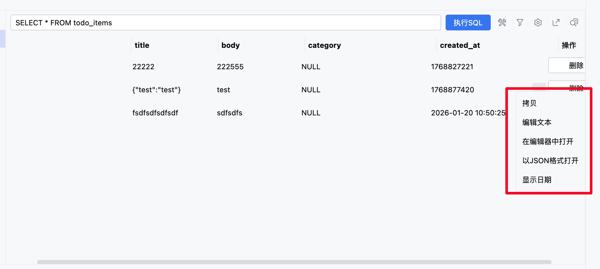

# Drift

> v 6.9.0 新規追加

## 概要

Drift データベースビューア。データベースの視覚的な操作をサポートします。

## 機能

- データベーステーブルの表示
- 並べ替えとフィルタリング
- CSV エクスポート
- エディタでのデータテーブルのプレビュー
- 列幅の動的調整
- 列データの編集
- テーブルデータの削除
- データテーブルの動的実行

## 使用方法

プロジェクトに drift 関連の依存関係を追加し、データベースを開くためのコードを実行する必要があります。そうすることでプラグインに表示されます。

## スクリーンショットのプレビュー

## 並べ替え

<video controls autoplay loop muted playsinline style="max-width: 100%; height: auto;" aria-label="Drift sorting demo" src="../../../assets/videos/vm/drift/drift_排序.mp4"></video>

## フィルタリング

<video controls autoplay loop muted playsinline style="max-width: 100%; height: auto;" aria-label="Drift filtering demo" src="../../../assets/videos/vm/drift/drift_过滤.mp4"></video>

## エディタでのデータテーブルのプレビュー

> これには IDE プラグインのサポートが必要です。バージョン 2025.2.3 で追加のプラグインなしでテストに成功しました。

## 列データの編集

<video controls autoplay loop muted playsinline style="max-width: 100%; height: auto;" aria-label="Drift edit column data demo" src="../../../assets/videos/vm/drift/drift_edit_column_data.mp4"></video>

## CSV エクスポート

## SQLite としてエクスポート

## 列幅の調整

<video controls autoplay loop muted playsinline style="max-width: 100%; height: auto;" aria-label="Drift resizable columns demo" src="../../../assets/videos/vm/drift/drift_move_column_resize.mp4"></video>

## その他

値のコピー、エディタでテキストを開く、値を JSON として開くなど、いくつかの一般的な機能もあります。

