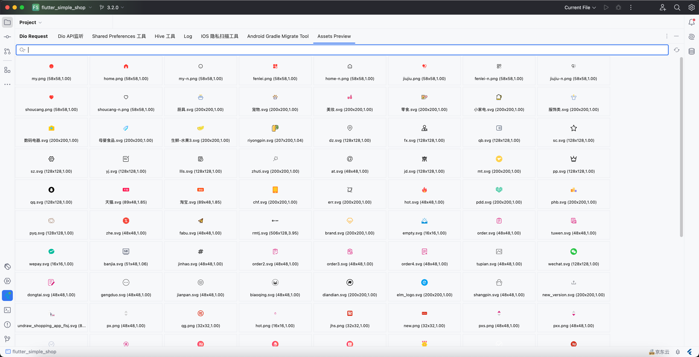
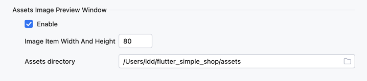

# 资产预览窗口

这里方便你浏览项目中的所有图片文件，svg图标等等

> 右键唤起菜单，支持快速拷贝为 dart组件

## 1.窗口预览

支持使用文件名来过滤搜索

<<<<<<< HEAD

=======

>>>>>>> 9bd2974a6a06cdcd4b0cf104e44238350abd1f8a

## 2.右键菜单，拷贝组件

<<<<<<< HEAD

=======

>>>>>>> 9bd2974a6a06cdcd4b0cf104e44238350abd1f8a

## 3.设置

* 可以在这里配置item的大小，和是否启用这个功能
* 可以配置你的自定义 assets文件目录，默认是 assets文件夹

<<<<<<< HEAD

=======

>>>>>>> 9bd2974a6a06cdcd4b0cf104e44238350abd1f8a

