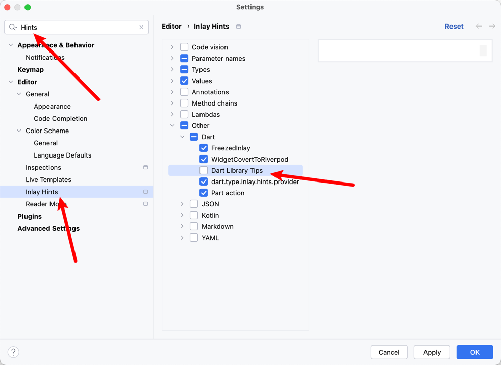

# Project Library scan

dart library auto suggestions completion

## Preview

> **注意**
> [Go to download](https://plugins.jetbrains.com/plugin/18986-flutterx/edit/versions/stable/576724)

enter the `part` trigger recommendations

<<<<<<< HEAD

=======

>>>>>>> 9bd2974a6a06cdcd4b0cf104e44238350abd1f8a

## How to close

<<<<<<< HEAD

=======

>>>>>>> 9bd2974a6a06cdcd4b0cf104e44238350abd1f8a

