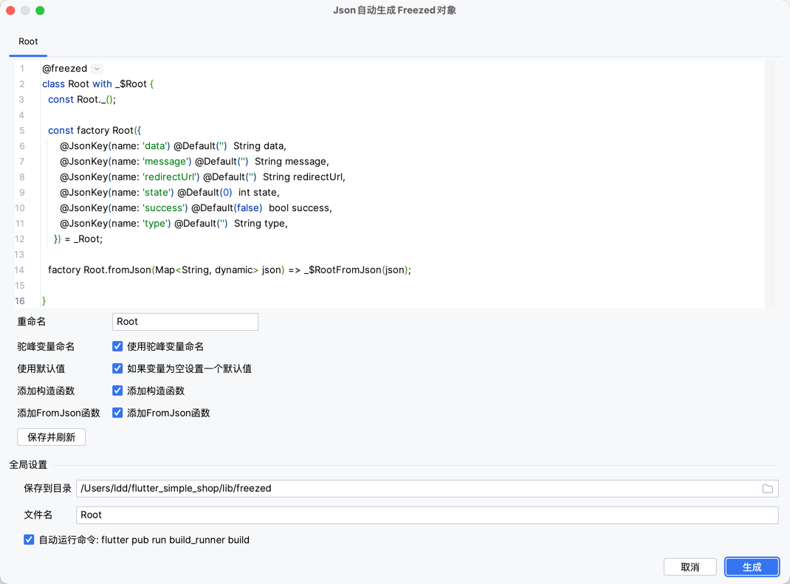

# Dio接口监听

## 1.窗口预览

如果找不到这个窗口,可能是默认没有显示,需要在菜单栏中手动打开: `View -> Tool Windows -> Dio Request`


## 2.服务运行状态

如果出现小绿点,标识服务正在运行,可以开始连接使用了


## 3.开始使用

[](https://pub.dev/packages/dd_check_plugin)

#### 添加依赖

```yaml
 dd_check_plugin: ^lastVersion
```

#### 拉取依赖

```bash
flutter pub get
```

#### 编写代码

把你的 Dio 单例类传进去,插件会添加一个拦截器监听请求,然后把请求模型发送到 FlutterX插件端.

```dart
    void main(){
    DdCheckPlugin().init(Dio(),
        initHost: "192.168.100.63",
        port: 9999,
        projectName: 'App Name');
}
```

> **说明**
>
> 简单解释一下这个功能的实现原理,FluterX插件端,运行了一个 Socket服务端,然后通过DdCheckPlugin#init函数的initHost来连接并进行
> 数据传输.[部分源码:](https://github.com/mdddj/dd_flutter_idea_plugin/blob/d5a57dcf769fd59c383fd89d21e6f6503bff948c/src/main/kotlin/shop/itbug/fluttercheckversionx/socket/service/DioApiService.kt#L112)

下面是`DdCheckPlugin#init`函数的一些属性说明

| 参数 | 说明 |
|---|---|
| initHost | 你的本机 IP, 不要设置成 127.0.0.1,不然真机模式下连不上,键入`1`插件会有自动补全,选择就行 |
| port | 监听端口,默认 9999,可以在设置里面更改,没啥特殊需求就不要改了,修改这个设置后记得重启 AS |
| projectName | 自定义你的项目名字 |
| customCoverterResponseData | 这里可以修改传到 idea 里面的数据模型,没啥事也不用改. 但是可以添加额外的备注信息 |
| timeOut | 连接 idea 插件的超时时间 |
| hostHandle | 如果不传 initHost,函数会扫描你的 IP 段,尝试自动连接,一般用不上 |
| version | 传输数据格式版本,这里一般不用改 |
| conectSuccess | 连接插件成功的回调,回调一个连接 scoket对象,一般用不上 |
| extend | 其他的一些工具扩展,比如 Hive工具的扩展: `HiveToolManager` ,你也可以实现`ServerMessageHandle`接口来处理idea 插件发送过来的数据 |


## 4.自动补全 initHost

插件会自动识别你的 IP 地址,并给出提示


## 5.给接口添加备注

> **注意**
>
> 需要 FlutterX版本3.8.0+

使用`customCoverterResponseData`属性来自定义发送给 ide的 response 模型
看下面这个例子

```dart
    DdCheckPlugin().init(
        BaseApi.getDio(),
        customCoverterResponseData: _customCoverterResponseData
);

SendResponseModel _customCoverterResponseData(SendResponseModel sendResponseModel) {
  final notes = <String>[];
  if (sendResponseModel.url.contains("/tkapi/api/v1/dtk/apis/goods")) {
    notes.add("首页产品列表接口");
  } else if (sendResponseModel.url.contains("/tkapi/api/v1/dtk/apis/carousel-list")) {
    notes.add("轮播图接口");
  } else if (sendResponseModel.url.contains("/api/get-user-by-token")) {
    notes.add("使用 token 获取用户信息模型");
  }
  notes.add("${sendResponseModel.response?.data.runtimeType}"); //添加response返回类型
  return sendResponseModel.copyWith(extendNotes: notes);
}
```

效果如图,`SendResponseModel#extendNotes`里面的字符串数组会在 url循环遍历成标签显示


如果备注太多,建议使用宽松模式来显示


这是我的配置


## 6. Json 转 Freezed 模型

> 如果你还不知道 freezed是什么, 强烈建议你了解一下. [链接](https://pub.dev/packages/freezed)

选中某个接口后,点击这个图标,会弹出 json 转 freezed 模型的配置弹窗
或者右键点击接口弹出菜单里面也有这个选项





