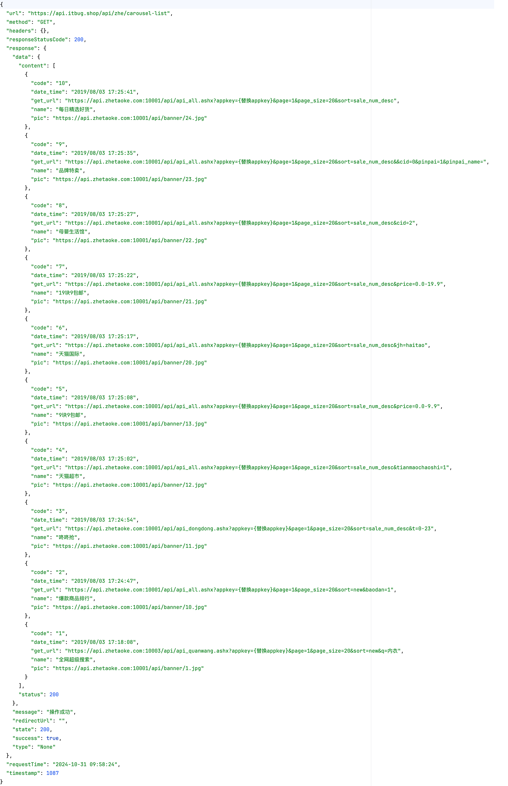
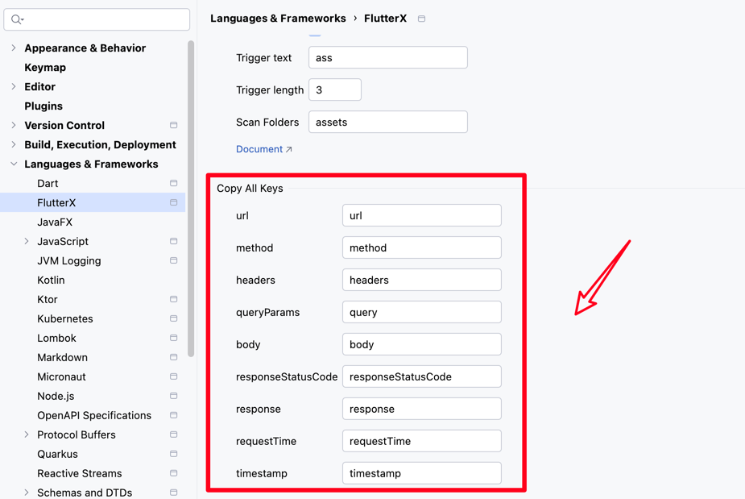

# 接口信息截图

右键选中接口菜单

选择拷贝api接口信息,它会把接口信息复制到你的剪贴板

> 注意,如果接口的信息过大,会导致失败并报错,这个暂时不解决

<<<<<<< HEAD

=======

>>>>>>> 9bd2974a6a06cdcd4b0cf104e44238350abd1f8a

## 截图示例

这个就是截图出来的,里面的key可以在设置中修改

<<<<<<< HEAD

=======

>>>>>>> 9bd2974a6a06cdcd4b0cf104e44238350abd1f8a

## 修改截图key

<<<<<<< HEAD

=======

>>>>>>> 9bd2974a6a06cdcd4b0cf104e44238350abd1f8a
