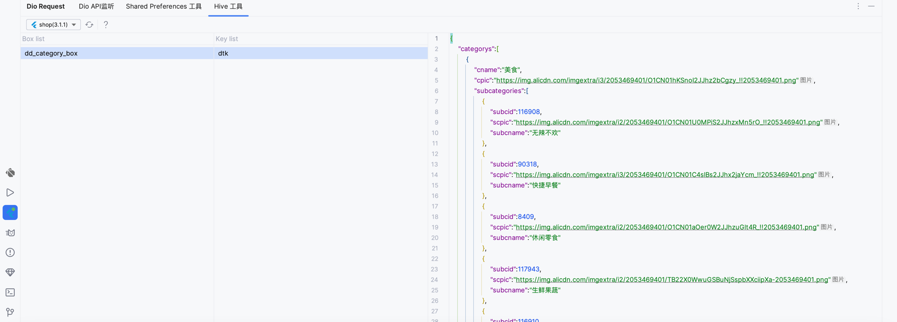

# Hive 缓存查看工具

## 1.开始使用

你需要在项目中添加依赖`dd_check_plugin`,并在合适的位置初始化连接

```dart
    void main(){
    DdCheckPlugin().init(Dio(),
        initHost: "192.168.100.63", //换成你的电脑 ip
        port: 9999, //插件监听端口
        projectName: 'App Name',
        extend: [
            HiveToolManager(boxList: [
              // 关键的代码添加到这里,需要实现DdPluginHiveBox抽象类
            ])
    ]);
}
```


`DdPluginHiveBox`类的定义

```javascript
abstract class DdPluginHiveBox<T> {
  final String boxName;

  DdPluginHiveBox(this.boxName);

  Future<Box<T>> get getBox;
}

```

> 这里解释一下为什么要手动实现一个 `getBox`函数,因为Hive打开一个盒子,默认不传 T 泛型,就是默认的一个 dynamic类型,这样打开Hive会报错.


| 属性      | 说明          |
|---------|-------------|
| boxName | 你的 Hive盒子名称 |
| getBox  | 返回盒子对象      |


## 2. 使用示例

面板中有 3 列,第一列是盒子列表, 第二列是第一列选中盒子里面所有的 key, 第三列是第 2 列选中的 key对应的 value

> 如果想改变key对应的 value值,可以重写它的 toString 函数




对应的代码

```javascript
    await DdCheckPlugin().init(dio, initHost: '192.168.100.64', port: 9998, projectName: 'shop', extend: [
      HiveToolManager(boxList: [MyCategoryCache()])
    ]);

```
实现DdPluginHiveBox接口就可以了
```javascript
class MyCategoryCache extends DdPluginHiveBox<CategoryWrapper> {
  MyCategoryCache() : super("dd_category_box");

  @override
  Future<Box<CategoryWrapper>> get getBox => Hive.isBoxOpen(boxName) ? Future.value(Hive.box(boxName)) : Hive.openBox(boxName);
}

```
