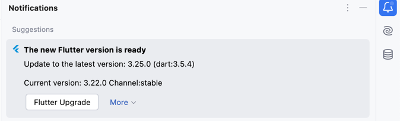

# flutter新版本检测

默认打开flutter项目的时候会启动一个进程,发起一个http请求,会访问flutter版本信息的接口

请求URL

> URL: [https://storage.googleapis.com/flutter_infra_release/releases/releases_macos.json](https://storage.googleapis.com/flutter_infra_release/releases/releases_macos.json)

> 接口需要开启代理才能访问

## 截图预览

<<<<<<< HEAD

=======

>>>>>>> 9bd2974a6a06cdcd4b0cf104e44238350abd1f8a

whats new 会跳转到flutter github仓库的CHANGELOG.md文件

## 功能需要满足2个条件

新版本检查需要满足2个条件

* flutter命令需要能正常调用
* 能正常访问上面的url接口

## 不需要这个功能,在这里关闭它

<<<<<<< HEAD

=======

>>>>>>> 9bd2974a6a06cdcd4b0cf104e44238350abd1f8a
