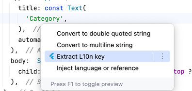

# l10n editor

## 1.Config l10n folder

open flutterx setting panel

<<<<<<< HEAD

=======

>>>>>>> 9bd2974a6a06cdcd4b0cf104e44238350abd1f8a

> **注意**
>

## 2.Use l10n panel

<<<<<<< HEAD

Enter your new key

Click ok button,it will inset key to your all arb files

=======

Enter your new key

Click ok button,it will inset key to your all arb files

>>>>>>> 9bd2974a6a06cdcd4b0cf104e44238350abd1f8a

## Extract l10n key

Quickly extract strings as l10n keys

<<<<<<< HEAD

=======

>>>>>>> 9bd2974a6a06cdcd4b0cf104e44238350abd1f8a

It will insert a new json node in app_en.arb

<<<<<<< HEAD

=======

>>>>>>> 9bd2974a6a06cdcd4b0cf104e44238350abd1f8a

## More features are being added..

