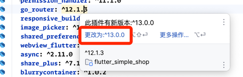
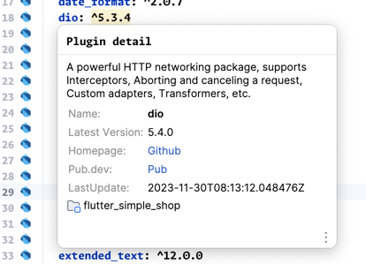

# 第三方包工具

这里介绍下`pubspec.yaml`文件的相关功能

## 搜索包

插件内直接搜索包

<<<<<<< HEAD

=======

>>>>>>> 9bd2974a6a06cdcd4b0cf104e44238350abd1f8a

## 插件新版本检测

<note>

典典建议把所有包都更新到最新版本,可以避免很多隐藏的 bug

</note>

> 如果不需要检测新版本,点击左边 dart图标,点击"不检测新版本",下次进入文件后会自动忽略

<<<<<<< HEAD

=======

>>>>>>> 9bd2974a6a06cdcd4b0cf104e44238350abd1f8a

## 插件信息面板

把鼠标浮动到插件名字上面,会出现插件详情面板

<<<<<<< HEAD

=======

>>>>>>> 9bd2974a6a06cdcd4b0cf104e44238350abd1f8a

## 快速跳转到包主页

点击图标会跳转到pub.dev包主页

<<<<<<< HEAD

## 检测没有被使用的包

=======

## 检测没有被使用的包

>>>>>>> 9bd2974a6a06cdcd4b0cf104e44238350abd1f8a

## 检查包信息

在这里可以查看包的更新日期,建议把长时间没有更新的包替换掉

<<<<<<< HEAD

=======

>>>>>>> 9bd2974a6a06cdcd4b0cf104e44238350abd1f8a
