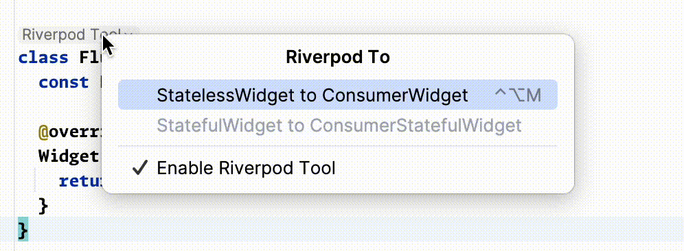
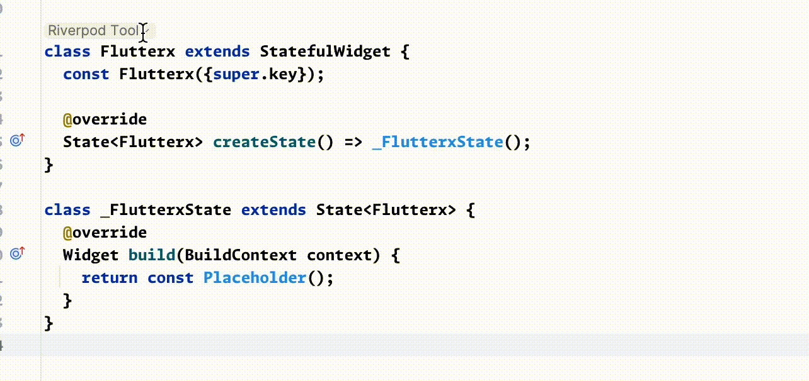

# Riverpod Widget Tool

这个工具可以将 StatelessWidget 自动转换成 ConsumerWidget

也可以将 StatefulWidget 自动转换成 ConsumerStatefulWidget

> 虽然 Riverpod 作者提供了一个plugin包`custom_lint`也可以实现类似的功能,但是这个包会在后台启动一个 dart分析器,占用的内存极大(约占用2G内存),内存大的用户可忽略这个功能

<warning>
    
注意,你需要添加了flutter_hooks这个包才能用这个功能

</warning>

####  功能预览(StatelessWidget)

####  功能预览(StatefulWidget)

