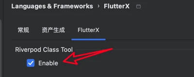
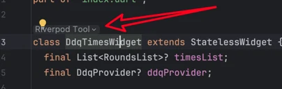
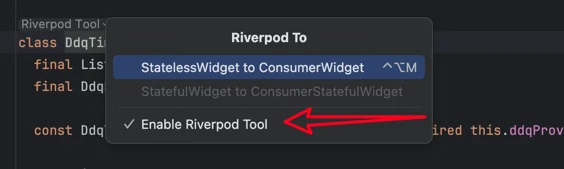
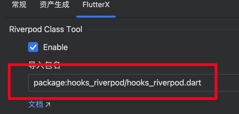

# riverpod

是否在编辑器中显示riverpod快速切换工具

关闭后将不会显示这个

这里也可以开启或者关闭

## 自动导包

<video controls autoplay loop muted playsinline style="max-width: 100%; height: auto;" aria-label="Riverpod settings auto import demo" src="../../../assets/videos/gif/Kapture_2024-10-30_at_11.24.11.mp4"></video>

> 设置中自定义导包内容,也可以是其他包

