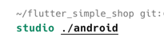
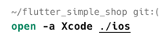
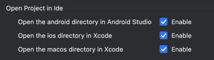
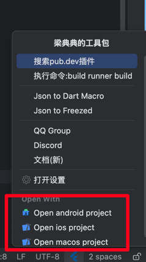

# 快速打开子目录文件夹

打开对应的命令:

> Android studio: `studio android path`

> xcode: `open -a Xcode ios/macos path`

如果打开失败,确认一下这些命令是不是有效

<<<<<<< HEAD

=======

>>>>>>> 9bd2974a6a06cdcd4b0cf104e44238350abd1f8a

## 设置

这些是功能开关,可以关闭在底部快捷菜单中显示这些功能

<<<<<<< HEAD

=======

>>>>>>> 9bd2974a6a06cdcd4b0cf104e44238350abd1f8a

如果在设置中关闭,下面红圈内的快捷操作将被隐藏

<<<<<<< HEAD

=======

>>>>>>> 9bd2974a6a06cdcd4b0cf104e44238350abd1f8a

