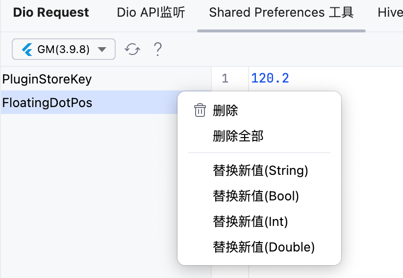

# shared_preferences工具

这个工具窗口可以用来查看`shared_preferences`插件的缓存

> 使用这个的前提,也是和 Dio那里的步骤一样,需要使用 dd_check_plugin 先连接 idea

## 预览

左侧是你的所有key列表

右侧显示的key对应的value值

<<<<<<< HEAD

=======

>>>>>>> 9bd2974a6a06cdcd4b0cf104e44238350abd1f8a

## 右键菜单

> 需要`dd_check_plugin`版本大于等于 4.0.2，`flutterX`版本大于等于5.7.0

你可以在这里操作 SP 缓存

<<<<<<< HEAD

=======

>>>>>>> 9bd2974a6a06cdcd4b0cf104e44238350abd1f8a

